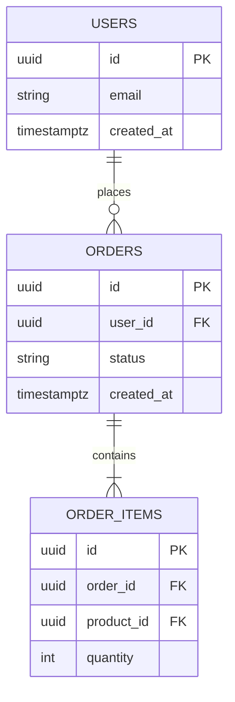

# data-modeling.md

## Purpose

Define conventions for data modeling — covering ER diagrams, normalization
rules, relationship patterns, and when to choose relational vs NoSQL storage.

---

## Conventions

### Modeling Process

Always follow this order before writing any schema or migration:

```
1. Identify entities — what are the core nouns in the domain?
2. Identify attributes — what data does each entity hold?
3. Identify relationships — how do entities relate to each other?
4. Determine cardinality — one-to-one, one-to-many, many-to-many?
5. Normalize — eliminate redundancy (aim for 3NF minimum)
6. Denormalize intentionally — only where query performance demands it
7. Document in an ER diagram before writing any DDL
```

### Entity Identification

- An entity is a real-world object or concept that has data worth storing
- Entities become tables: `User`, `Order`, `Product`, `Invoice`
- Attributes become columns: `User.email`, `Order.status`, `Product.price`
- Avoid "god tables" — tables that hold data for multiple unrelated concepts

### Relationship Patterns

#### One-to-Many (Most Common)

```
User (1) ──────< Orders (many)
- Foreign key lives on the "many" side: orders.user_id
```

```sql
CREATE TABLE orders (
    id          UUID PRIMARY KEY DEFAULT gen_random_uuid(),
    user_id     UUID NOT NULL REFERENCES users(id) ON DELETE CASCADE,
    ...
);
```

#### Many-to-Many

```
Products >──────< Tags
- Requires a junction table: product_tags
```

```sql
CREATE TABLE product_tags (
    product_id  UUID NOT NULL REFERENCES products(id) ON DELETE CASCADE,
    tag_id      UUID NOT NULL REFERENCES tags(id) ON DELETE CASCADE,
    created_at  TIMESTAMPTZ NOT NULL DEFAULT NOW(),
    PRIMARY KEY (product_id, tag_id)
);
```

#### One-to-One

```
User (1) ──────── (1) UserProfile
- Foreign key on the table that is the "extension"
- Use when splitting a table for performance or access control
```

```sql
CREATE TABLE user_profiles (
    id          UUID PRIMARY KEY DEFAULT gen_random_uuid(),
    user_id     UUID UNIQUE NOT NULL REFERENCES users(id) ON DELETE CASCADE,
    bio         TEXT,
    avatar_url  TEXT,
    ...
);
```

### Normalization Rules

#### 1NF — First Normal Form

- Every column holds atomic values — no arrays or comma-separated lists in a column
- Every row is uniquely identifiable (primary key exists)

```sql
-- WRONG: comma-separated values in column
INSERT INTO users (tags) VALUES ('admin,editor,viewer');

-- CORRECT: separate junction table
INSERT INTO user_roles (user_id, role) VALUES ($1, 'admin'), ($1, 'editor');
```

#### 2NF — Second Normal Form

- No partial dependencies — every non-key column depends on the whole primary key
- Applies mainly to tables with composite primary keys

#### 3NF — Third Normal Form

- No transitive dependencies — non-key columns depend only on the primary key, not on other non-key columns

```sql
-- WRONG: city depends on zip_code, not on user id (transitive dependency)
CREATE TABLE users (id, zip_code, city, country);

-- CORRECT: extract to separate table
CREATE TABLE zip_codes (zip_code, city, country);
CREATE TABLE users (id, zip_code REFERENCES zip_codes);
```

### When to Denormalize

Only denormalize when:

- Query performance is measured and provably insufficient with normalized schema
- The denormalized field is read far more often than it is written
- The duplicated data can be kept consistent with triggers or application logic

Document every denormalization decision with a comment explaining why.

### Choosing Relational vs NoSQL

| Use Relational (PostgreSQL) when: | Use NoSQL (MongoDB, DynamoDB) when:        |
| --------------------------------- | ------------------------------------------ |
| Data has clear relationships      | Data is document-like with variable schema |
| ACID transactions required        | Horizontal write scaling is critical       |
| Complex queries with JOINs needed | Access pattern is always by single key     |
| Schema is stable and well-defined | Schema evolves rapidly and unpredictably   |
| Reporting and aggregations needed | Storing blobs, logs, or time-series data   |

**Default choice: PostgreSQL** unless there is a specific, documented reason to use NoSQL.

### JSON Columns in PostgreSQL

Use `JSONB` column type only when:

- The data structure is genuinely variable per row
- The JSON content does not need to be individually queried or indexed
- Storing configuration, metadata, or third-party API payloads

Never use `JSONB` as a replacement for proper normalization.

### ER Diagram Requirements

Before any schema is implemented, produce an ER diagram documenting:

- All entities and their key attributes
- All relationships with cardinality notation
- All foreign key directions

Use Mermaid syntax for ER diagrams stored in the repo:



---

## Anti-Patterns

- Never store comma-separated values in a single column — normalize into a table
- Never skip ER diagram for non-trivial schemas — model before you build
- Never denormalize preemptively without measuring the performance problem first
- Never use `JSONB` to avoid proper modeling of structured data
- Never create god tables that mix data for multiple unrelated concepts
- Never choose NoSQL by default — start with PostgreSQL, migrate if needed

---

## Ready-to-Use Prompt

```
Task: Model the data for [feature or domain]
Skill: database/data-modeling, database/schema-design

DOMAIN DESCRIPTION:
[Describe the business domain, entities, and key rules]

STEP 1 — ENTITY IDENTIFICATION:
- List all core entities
- List key attributes per entity

STEP 2 — RELATIONSHIPS:
- Describe relationships between entities
- Determine cardinality: 1:1, 1:many, many:many

STEP 3 — NORMALIZATION:
- Verify 1NF: no multi-value columns
- Verify 2NF: no partial dependencies
- Verify 3NF: no transitive dependencies

STEP 4 — STORAGE DECISION:
- Apply relational vs NoSQL decision table
- Default to PostgreSQL unless documented reason exists

STEP 5 — ER DIAGRAM:
- Produce Mermaid ER diagram before writing any DDL

DONE WHEN:
- ER diagram produced and stored in repo
- All entities normalized to 3NF minimum
- All relationships have correct cardinality and FK direction
- Storage decision documented if NoSQL is chosen
- Schema design follows schema-design.md conventions
```

